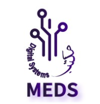

#  MEDS Lab Training Repository

Welcome to the official training repository for the **MEDS Lab (Microelectronic Digital Systems)**. This repository serves as a centralized hub documenting the technical journey, completed modules, lecture logs, and assessments covered during the training program.

  

---

##  Overview

This repository captures a rigorous, hands-on engineering track focused on foundational development tools, modern workflows, and digital design verification methodologies essential for microelectronic digital system design.

---

##  Checklist of Completed Topics

We have successfully traversed and wrapped up Module One, covering foundational technologies required for digital systems engineering:

- [x] **Linux Shell Scripting**
  - Mastered the core command-line tools to navigate modern filesystems and manage files seamlessly.
  - Implemented automated text processing and robust automation workflows via customized shell scripts.
- [x] **Vim Editor**
  - Explored modal text editing mechanisms to drastically increase efficiency while working within headless terminal setups.
  - Learned core navigation bindings, text manipulation commands, and internal file buffers.
- [x] **Visual Studio Code (VS Code)**
  - Configured an optimized IDE workspace designed for development and debugging.
  - Integrated terminal environments, set up custom linting, and installed core engineering extensions.
- [x] **Git & Version Control**
  - Mastered distributed local version tracking alongside distributed remote collaboration workflows.
  - Implemented branch architectures, merge workflows, and clean conflict resolution protocols entirely inside the VS Code development space.
- [x] **Markdown Documentation**
  - Acquired standard engineering documentation principles to construct well-structured `README.md` files, progress trackers, and detailed training guides.
- [x] **Verilator & Simulation Workflows**
  - Evaluated high-performance hardware description simulations by translating **SystemVerilog** codebases into highly optimized **C++** testbenches.
  - Examined complex logic behaviors and timing diagrams using **GTKwave** for waveform visualization.

---

##  Repository Architecture & Contents

###  1. Onur's Lectures
Contains detailed Markdown (`.md`) technical write-ups, code snippets, and key architectural observations compiled directly from **Onur's Lecture Series**. These files outline the deep-dive theory and step-by-step implementations corresponding to each session of the training track.

###  2. Grand Assessment (Module One)
A comprehensive milestone project validating all core competencies gained throughout the first training module. It contains the complete practical implementation, script setups, and documentation detailing the solution to the module's primary evaluation guidelines.

---
